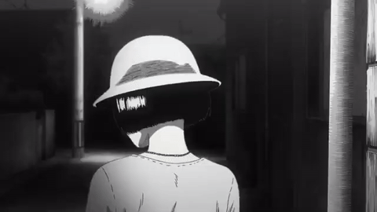

  

 

  
  
  

---

### `// ABOUT`

- 🎓 B.S. Computer Science — California State University, Long Beach
- 🖥️ IT Coordinator — 500+ end users, and every single one of them has a ticket open right now
- 🌱 Currently spiraling deeper into full-stack + automation
- 💬 Ask me about: networking, sysadmin work, Python automation, or LaTeX
---

### `// TECH STACK`

  

  
  
  
  

---

### `// EXPERIENCE LOG`

| Role | Org | Highlights |
|---|---|---|
| IT Coordinator | Junipero Serra High School | Supported 500+ users; networking, MDM, Google Workspace, Active Directory, E-Rate compliance |
| Tutor | Rothem Education | Taught Python & math fundamentals through hands-on coding |
| Project Team Lead | NASA Aerospace Scholars | Led project planning, task tracking, and team coordination |

---

---

🌀 <i>thanks for reading this far. the repo remembers.</i> 🌀

